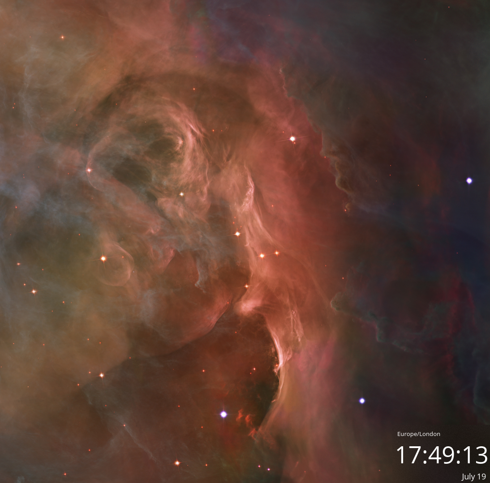
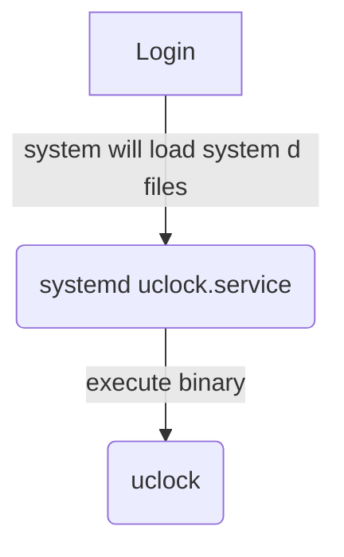
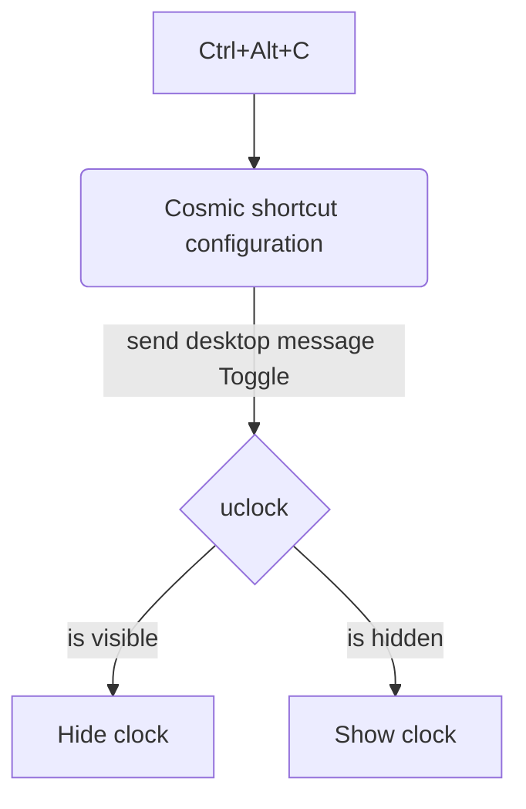

# Uclock

time cosmic widget triggered by dbus messages.

This is a tool to visualise the time of the day. The tool is toggable, it can receive a desktop bus message to hide and show.



These are the technologies used relevant to understand how the project runs

| Tech | What it does | Why |
| --- | ---- | --- |
| Rust    |       | Personal preference and easier integration with Cosmic Lib |
| DBus    | toggle app visibility       | To facilitate communicating from the operating system to the app |
| Cosmic lib    | Render the app       | To have the same look and feel of a cosmic popos app |
| System service    | Auto start the app on login       |  Just a few lines of config to start the app|

## Diagram 
### Startup Flow
When you log in to Cosmic, systemd automatically launches uclock in the background. The app initializes its DBus interface and waits for incoming messages.



### Shortcut Flow
When you press a keyboard shortcut configured in Cosmic Settings, the system sends a DBus message to uclock, which toggles the clock's visibility.



## Installation

### Run the script uclock/scripts/release.sh from the uclock folder

```
git clone 
cd `uclock`
./script/release.sh
```

It will: 
  - build the project in release mode and copy in the  ~/.local/bin/ folder so the service can find the executable
  - copy the uclock.service in ~/.config/systemd/user/uclock.service in order to have autostart on login
  - enable the service
    
### Setup your shortcut in cosmic

Open the Custom shortcuts in cosmic popos and copy the shortcut command below. Decide which shortcut to use to toggle the clock

shortcut command
```
gdbus call --session --dest com.utools.uclock --object-path /com/utools/uclock --method com.utools.uclock.Toggle
```

- gdbus -> tool to let you send messages
- call -> how to invoke it to send messages
- --session -> this is to send it just to the user session 
- --dest -> is the app id 
- --object-path -> if you want different destination, if you app is more complicated and you want to split it in multiple objects
- --method the method to call configured in your app


## Technical tradeoffs

### Tick message every second to re render cosmic view
I am not sure if this is the best approach but I've noticed that cosmic lib does not re render automatically.
In order to re render I send a tick message every second because the clock needs to be updated every second. Maybe this is the way!

### Static channel transport
In order to communicate between the desktop bus and the cosmic lib there is a broadcast channel initialised in the app that needs to be static because the cosmic lib subscription functionality runs in its own context without being able to provide a shared reference of the transport channel. Look at [src/desktop_message_transport.rs](./src/desktop_message_transport.rs)
